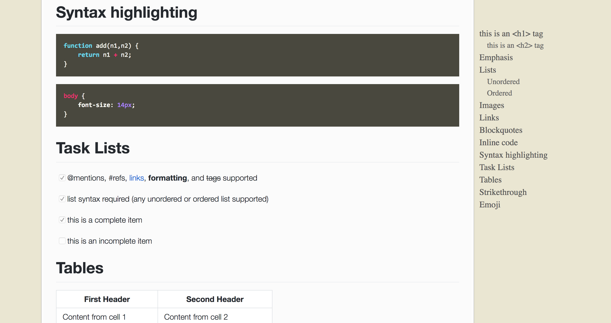

# The Fast theme

>  使用原生 js，少量 css 打造高性能、快响应、又简洁的主题




## 二种使用方式

1. 通过 gem 安装使用

   添加进 _config.yml 文件中

   ```bash
   theme: jekyll-theme-fast
   ```

   编辑 Gemfile 添加主题

   ```bash
   gem "jekyll-theme-fast"
   ```

   

2. 通过 git clone 直接更改使用

   ```bash
   git clone https://github.com/liurongqing/jekyll-theme-fast.git
   ```

   


### 环境（如果没有安装的话）
```bash
brew install ruby
gem install jekyll
```


### 预览

```bash
jekyll serve
```


### 打开浏览器

http://127.0.0.0:4000


### 说明

1. markdown 使用样式 

[github-markdown-css](https://github.com/sindresorhus/github-markdown-css)

2. rouge 代码高亮主题使用 syntax.monokai

   ```bash
    rougify help style # 查看主题列表
    rougify style syntax.monokai > syntax.monokai.css # 生成一个主题
   ```
